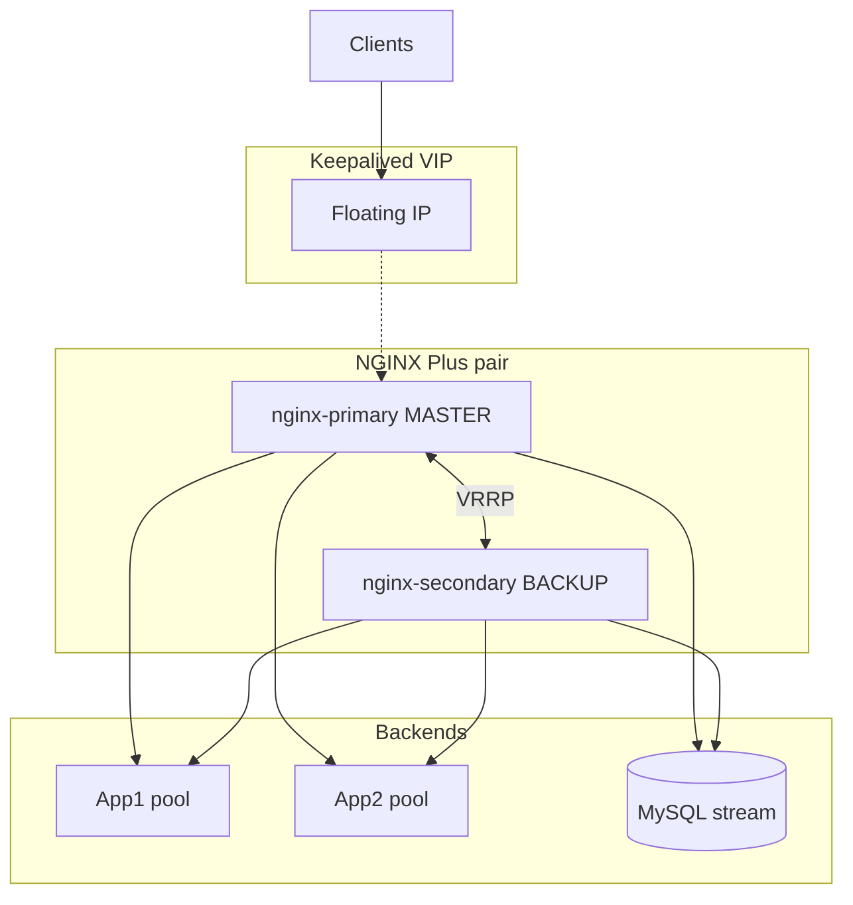

# NGINX Plus HA Cluster (Keepalived)

**Author:** José Martinez | Arkhadia by GHC

Automate **NGINX Plus** on **two Red Hat 9** nodes in **active/passive** mode using **Keepalived** (floating VIP), with optional app reverse-proxy and MySQL TCP stream configs.

---

## Architecture

Full diagrams (HA, traffic, deployment): **[docs/architecture.md](docs/architecture.md)**



---

## Repository layout

```
NGINX-CLUSTER-CS1/
├── docs/architecture.md
└── ansible/nginx/
    ├── site.yml
    ├── inventory.ini.example
    ├── group_vars/all.yml.example
    ├── files/              # license + TLS (local only, see files/README.md)
    ├── templates/
    └── *.yml playbooks
```

---

## Prerequisites

- Two RHEL 9 hosts (`nginx-primary`, `nginx-secondary`)
- SSH access (key or password)
- NGINX Plus repo credentials + `license.jwt`
- TLS cert/key for dashboard (wildcard `*.ghc.com` or your domain)
- Ansible >= 8

---

## Setup

```bash
cd ansible/nginx

cp inventory.ini.example inventory.ini
cp group_vars/all.yml.example group_vars/all.yml
# Edit: VIP, interface, backend IPs, server names, SSL paths

# Place secrets in files/ (see files/README.md):
#   nginx-repo.key, nginx-repo.crt, license.jwt, STAR.GHC.COM.crt, ghc.com.key

python3 -m venv .venv && source .venv/bin/activate
pip install -r requirements.txt
```

---

## Deployment

### Full stack

```bash
ansible-playbook site.yml
```

### Step by step

| Step | Playbook |
|------|----------|
| 1. Remove stock NGINX | `nginx-uninstall.yml` |
| 2. Install NGINX Plus | `nginx-install.yml` |
| 3. Copy TLS certs | `nginx-ssl-certs.yml` |
| 4. Main `nginx.conf` | `nginx-conf.yml` |
| 5. Upstreams + vhosts + stream | `nginx-deploy-conf.yml` |
| 6. Dashboard (open ACL, lab) | `nginx-dashboard-conf-open.yml` |
| 7. Harden dashboard | `fix-dashboard-api.yml` |
| 8. Keepalived VIP HA | `nginx-keepalived-ha.yml` |

---

## Validation

```bash
# VIP held on primary
ssh nginx-primary "ip addr | grep <vip>"

# Dashboard (open config)
curl -vk https://<vip>/dashboard.html

# Failover test
ssh nginx-primary "sudo systemctl stop keepalived"
ssh nginx-secondary "ip addr | grep <vip>"
```

---

## Security notes

- Do not commit `inventory.ini`, `group_vars/all.yml`, or `files/*.{key,crt,jwt}`.
- Replace `allow all` on dashboard with `fix-dashboard-api.yml` before production.
- Change default Keepalived `auth_pass` in `group_vars` (`keepalived_auth_pass`).

---

## Contact

- jmartinez@arkhadia.net
- [@genialcorpholding](https://github.com/genialcorpholding)
