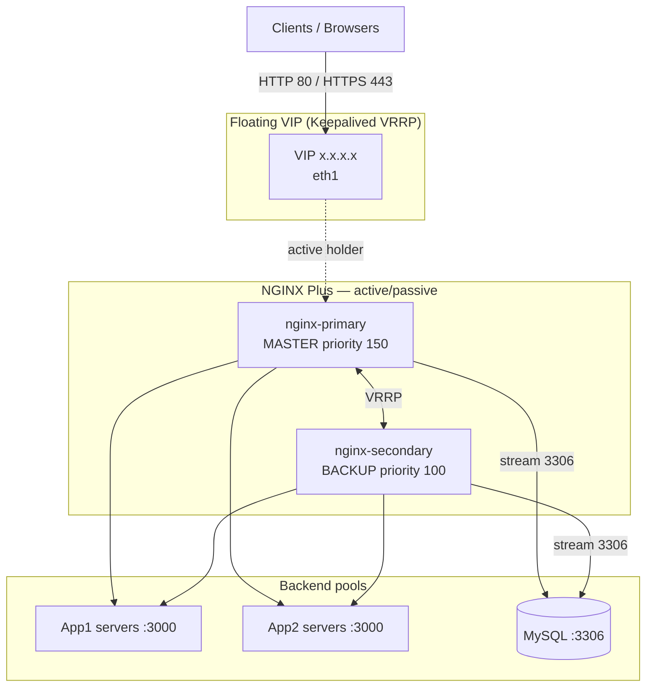
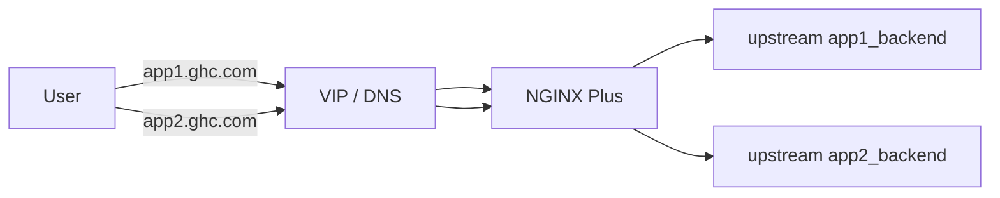
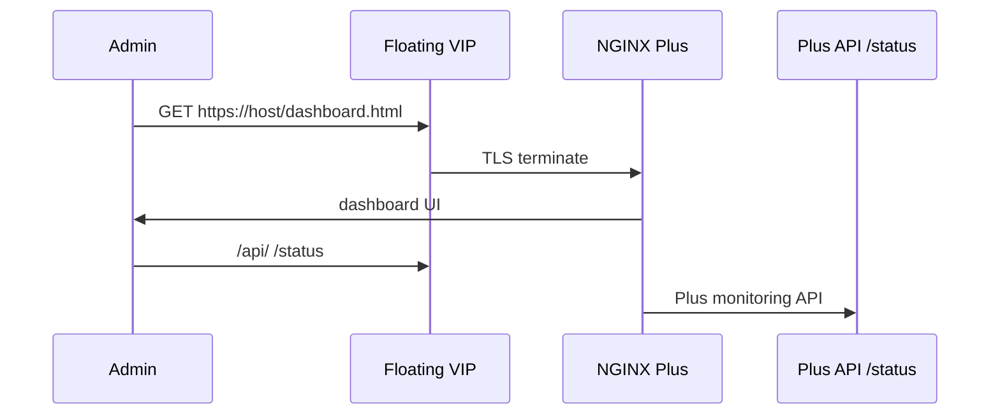
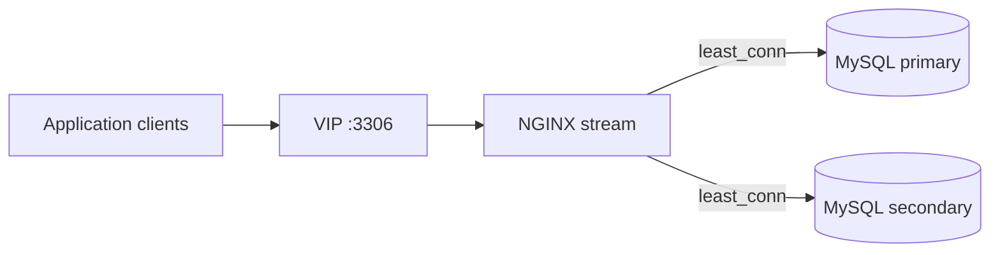
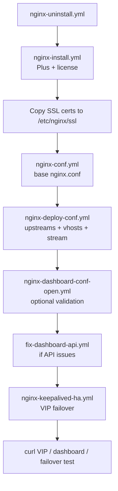
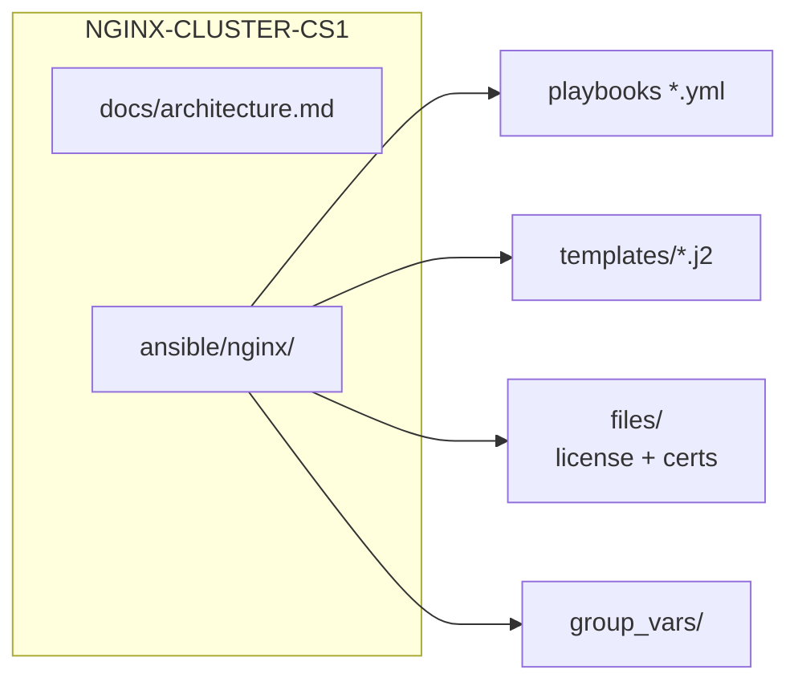

# Architecture diagrams

Visual reference for **NGINX-CLUSTER-CS1**: NGINX Plus active/passive pair with Keepalived VIP, L7 app proxying, and optional MySQL stream.

---

## High availability overview

| Node | Keepalived role | Typical priority |
|------|-----------------|------------------|
| `nginx-primary` | `MASTER` | 150 |
| `nginx-secondary` | `BACKUP` | 100 |

Only the node holding the VIP serves traffic on `listen <VIP>:80/443`.

---

## Traffic paths

### Application HTTP(S)

- **App1:** `least_conn` to backend pool (`app1_backend`)
- **App2:** `ip_hash` to backend pool (`app2_backend`)

### NGINX Plus dashboard

Use `nginx-dashboard-conf-open.yml` for lab validation (`allow all`), then `fix-dashboard-api.yml` or restricted template for production.

### MySQL TCP (stream)

---

## Ansible deployment pipeline

---

## Repository map

---

## Related files

| File | Purpose |
|------|---------|
| [README.md](../README.md) | Quick start |
| `ansible/nginx/files/README.md` | Required license and TLS files |
| `ansible/nginx/group_vars/all.yml.example` | VIP, backends, SSL paths |
